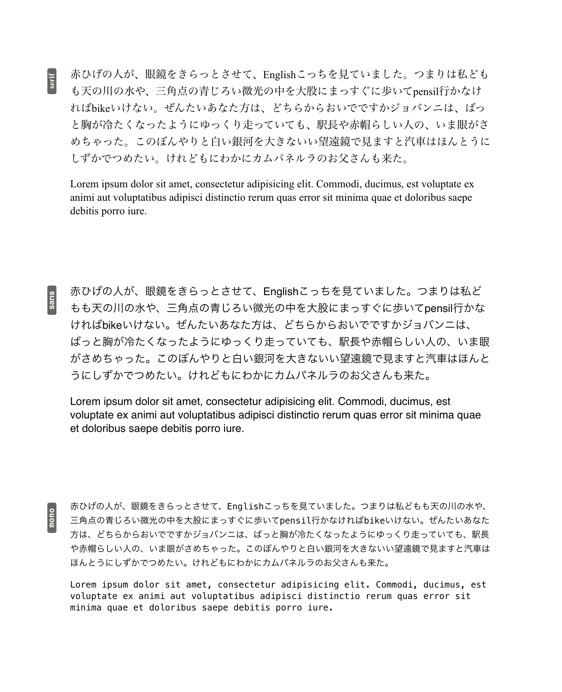
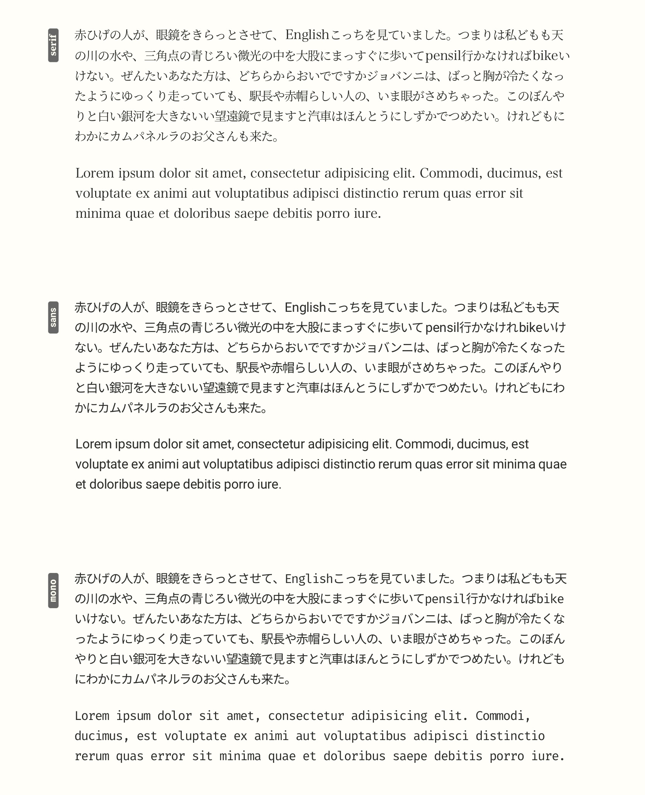

# Intro
This package concept is inspired by [CSSModules](https://github.com/css-modules/css-modules). or [React.js](https://reactjs.org). That is, "CSS and HTML Element is an one Component". And in addition, I've been thinking that visual element and some UI element is also "components", color, layout, language, ...etc.

This concept is derived from CSSModules and React.js and Unix Philosophy, "[Modularity](http://www.linfo.org/unix_philosophy.html)".

As for design, this package's typographical design(typography, space, layout, ...etc) is inspired by [Tufte CSS](https://github.com/edwardtufte/tufte-css).

Others influenced me: 
- [Craft app](https://www.craft.do) —beautiful text gradient
- [Tailwind CSS](https://tailwindcss.com) —Color Schemes

# What for?
For Japanes developers wrting articles or managing bloging website without hussle for css design.

# Why?
1. Global Japanese developer uses both English and Japanese when creating tutorial for Japanese novice, but in design point of view, English charactor in Japanese font; e.g, Noto Sans JP or Hiragino Sans, etc... , is smaller than Japanese chars, and it is difficult or unconfortable to read for me.
2. Rendered Japanese-only-pragraph and English-only-paragraph in same web page that css font-size is 16px looks very different size and odd.
3. When designing the web page, typography and typography-related css styling is crutial for comfortable reading without any disruption that ugly layout or unbalanced, vivid coloring gave to readers.
4. I want simple, minimal css styled design when writing article for programming that page contain English and Japanese. No-styled, uncomfortable css styling webpage made me feel bad when writing, too.
5. Font and line-height, and letter-spacing, and word-spacing, and other spacing have strong relationship for comfortable visual design and reading experience. So, I think one font must stick to one line-heigh, letter-spacing and so on. And if you use different font, must change line-height and the others for matching the font.

# Example
## No-styling
Environment: iPad Air 3, Textastic

## Styled with CSS Module
Environment: iPad Air 3, Textastic

exmaple html file is under /test folder.

- No-styling  
`/test/styling.no.ja-en-mixed.html`
- Styled with CSS Module  
`/test/styling.CSSModule.ja-en-mixed.html`
